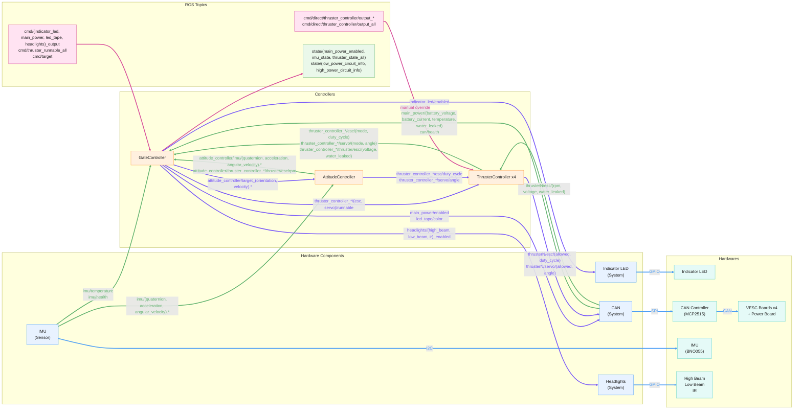

# sinsei_umiusi_control

## Structure

### Legend

| Visual       | Meaning                            |
| ------------ | ---------------------------------- |
| Pink nodes   | ROS topics (command)               |
| Green nodes  | ROS topics (state)                 |
| Orange nodes | `ros2_control` controllers         |
| Blue nodes   | `ros2_control` hardware components |
| Cyan nodes   | Physical hardware                  |
| Pink edges   | ROS topics                         |
| Purple edges | `ros2_control` command interfaces  |
| Green edges  | `ros2_control` state interfaces    |
| Blue edges   | Physical buses                     |

## Topics

All types of messages are defined in [sinsei_UMIUSI_msgs](https://github.com/rogy-AquaLab/sinsei_UMIUSI_msgs).

### Subscribed by `GateController`

| Topic Name                  | Type name (URL to `.msg` file)                                                                                    | Description                                                                               |
| --------------------------- | ----------------------------------------------------------------------------------------------------------------- | ----------------------------------------------------------------------------------------- |
| `cmd/indicator_led_output`  | [`IndicatorLedOutput`](https://github.com/rogy-AquaLab/sinsei_UMIUSI_msgs/tree/main/msg/IndicatorLedOutput.msg)   | Indicator LED output (Enabled / Disabled)                                                 |
| `cmd/main_power_output`     | [`MainPowerOutput`](https://github.com/rogy-AquaLab/sinsei_UMIUSI_msgs/tree/main/msg/MainPowerOutput.msg)         | Main power output (Enabled / Disabled)                                                    |
| `cmd/led_tape_output`       | [`LedTapeOutput`](https://github.com/rogy-AquaLab/sinsei_UMIUSI_msgs/tree/main/msg/LedTapeOutput.msg)             | LED tape output (RGBA values)                                                             |
| `cmd/headlights_output`     | [`HeadlightsOutput`](https://github.com/rogy-AquaLab/sinsei_UMIUSI_msgs/tree/main/msg/HeadlightsOutput.msg)       | Headlights output (Enabled / Disabled) for each of High beam, Low beam, and IR            |
| `cmd/thruster_runnable_all` | [`ThrusterRunnableAll`](https://github.com/rogy-AquaLab/sinsei_UMIUSI_msgs/tree/main/msg/ThrusterRunnableAll.msg) | Thruster runnable status (True / False for each of ESC and Servo motor) for each thruster |
| `cmd/target`                | [`Target`](https://github.com/rogy-AquaLab/sinsei_UMIUSI_msgs/tree/main/msg/Target.msg)                           | Target of the robot (Velocity and Angular vector)                                         |

### Subscribed by `ThrusterController`

| Topic Name                                  | Type name (URL to `.msg` file)                                                                                | Description                                                                             |
| ------------------------------------------- | ------------------------------------------------------------------------------------------------------------- | --------------------------------------------------------------------------------------- |
| `cmd/direct/thruster_controller/output_lf`  | [`ThrusterOutput`](https://github.com/rogy-AquaLab/sinsei_UMIUSI_msgs/tree/main/msg/ThrusterOutput.msg)       | Thruster output (`ThrusterRunnable`, ESC duty and Servo angle) for Left Front thruster  |
| `cmd/direct/thruster_controller/output_lb`  | [`ThrusterOutput`](https://github.com/rogy-AquaLab/sinsei_UMIUSI_msgs/tree/main/msg/ThrusterOutput.msg)       | Thruster output (`ThrusterRunnable`, ESC duty and Servo angle) for Left Back thruster   |
| `cmd/direct/thruster_controller/output_rb`  | [`ThrusterOutput`](https://github.com/rogy-AquaLab/sinsei_UMIUSI_msgs/tree/main/msg/ThrusterOutput.msg)       | Thruster output (`ThrusterRunnable`, ESC duty and Servo angle) for Right Back thruster  |
| `cmd/direct/thruster_controller/output_rf`  | [`ThrusterOutput`](https://github.com/rogy-AquaLab/sinsei_UMIUSI_msgs/tree/main/msg/ThrusterOutput.msg)       | Thruster output (`ThrusterRunnable`, ESC duty and Servo angle) for Right Front thruster |
| `cmd/direct/thruster_controller/output_all` | [`ThrusterOutputAll`](https://github.com/rogy-AquaLab/sinsei_UMIUSI_msgs/tree/main/msg/ThrusterOutputAll.msg) | Thruster output (`ThrusterOutput`) for each thruster                                    |

### Published by `GateController`

| Topic Name                      | Type name (URL to `.msg` file)                                                                                      | Description                                                                             |
| ------------------------------- | ------------------------------------------------------------------------------------------------------------------- | --------------------------------------------------------------------------------------- |
| `state/main_power_enabled`      | [`MainPowerEnabled`](https://github.com/rogy-AquaLab/sinsei_UMIUSI_msgs/tree/main/msg/MainPowerEnabled.msg)         | Main power enabled / disabled status                                                    |
| `state/imu_state`               | [`ImuState`](https://github.com/rogy-AquaLab/sinsei_UMIUSI_msgs/tree/main/msg/ImuState.msg)                         | IMU status (Acceleration, Angular Velocity, Quaternion, etc.)                           |
| `state/thruster_state_all`      | [`ThrusterStateAll`](https://github.com/rogy-AquaLab/sinsei_UMIUSI_msgs/tree/main/msg/ThrusterStateAll.msg)         | Thruster status (Mode, Duty Cycle, Angle, and RPM) for each thruster                    |
| `state/low_power_circuit_info`  | [`LowPowerCircuitInfo`](https://github.com/rogy-AquaLab/sinsei_UMIUSI_msgs/tree/main/msg/LowPowerCircuitInfo.msg)   | Health status (`0` for ok / `1` for error) for each low-power circuit                   |
| `state/high_power_circuit_info` | [`HighPowerCircuitInfo`](https://github.com/rogy-AquaLab/sinsei_UMIUSI_msgs/tree/main/msg/HighPowerCircuitInfo.msg) | Health-related values for each high-power circuit (Voltage, Current, WaterLeaked, etc.) |
